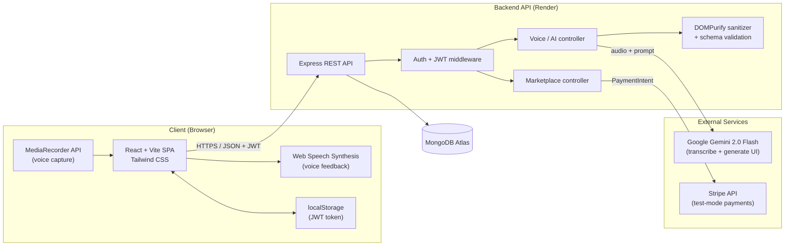
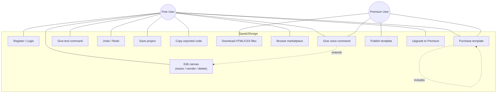
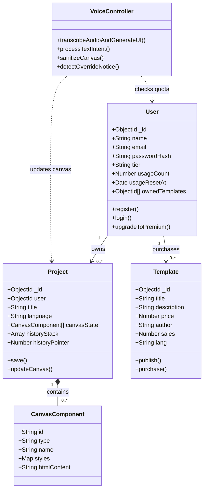
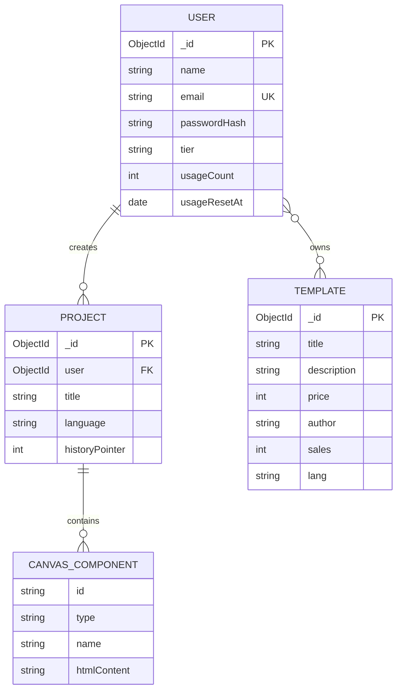
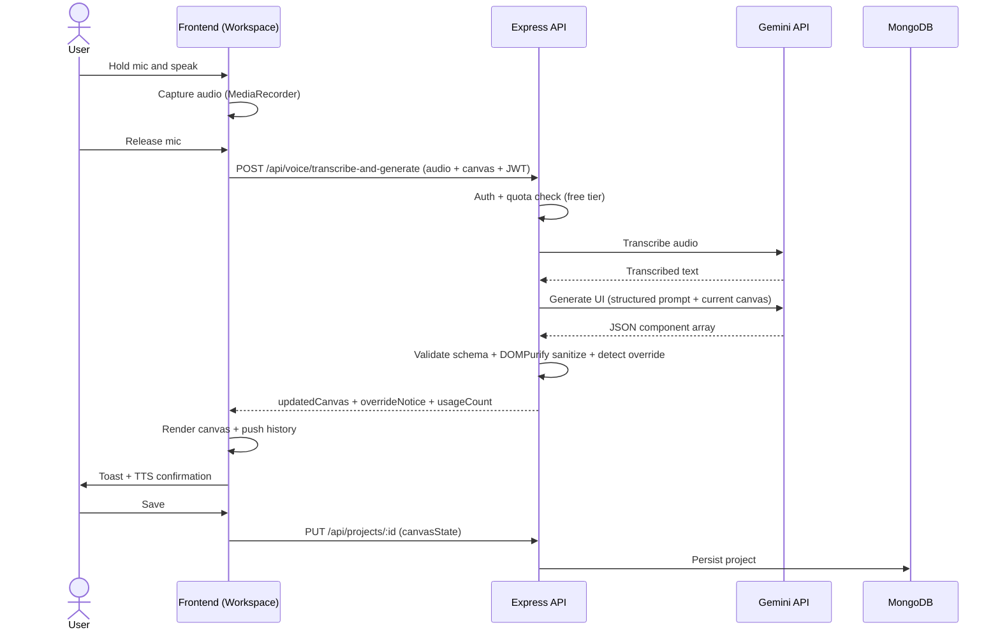
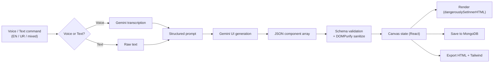

# Speak2Design — Architecture & Required Diagrams

Diagrams for the FYP Phase-II document. All are Mermaid (render on GitHub or any Mermaid viewer; export to PNG for pasting into the Word document).

---

## 1. System Architecture

---

## 2. Use-Case Diagram

> Free users are limited (10 commands/window, copy-only export, no publishing). Premium unlocks unlimited commands, file downloads (UC8) and publishing (UC11).

---

## 3. Class Diagram

---

## 4. ER Diagram

---

## 5. Sequence Diagram — Voice Command

---

## 6. Data-Flow Diagram

